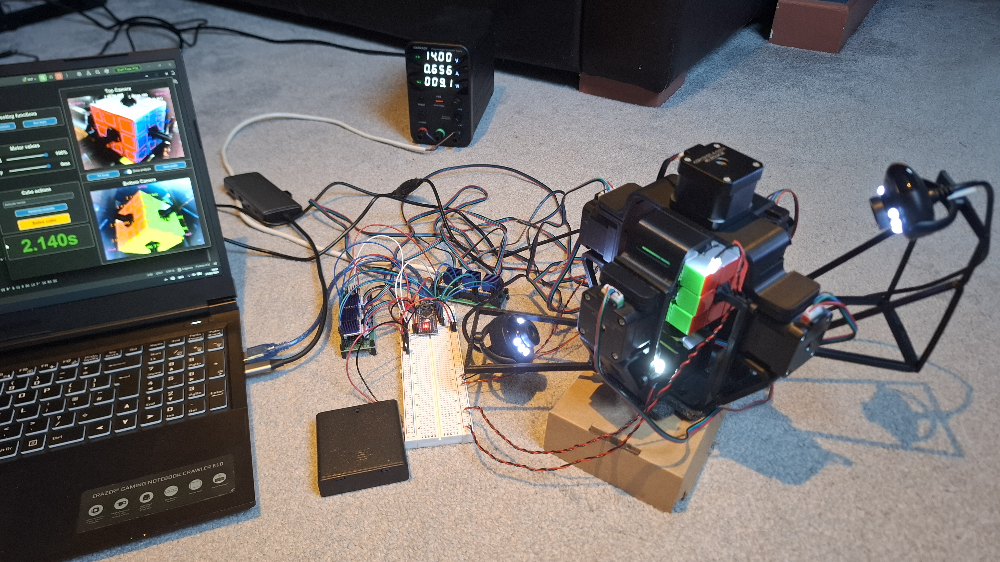

 # Robot Rubik's Cube Solver
 


An autonomous robot that scans, solves, and physically executes a solution to a scrambled 3×3×3 Rubik's Cube — with an average solve time of **2.13 seconds**, faster than the current human world record (2.76s).

Final Year Project for BEng (Hons) Electrical and Electronic Engineering (TU821), Technological University Dublin

**Author:** Peter Myler · **Supervisor:** Frank Duignan · May 2026

The project achieved a score of 86% and the student graduated with a 1st Class Honours (3.6 GPA).

**[Watch the demo video](https://youtu.be/nHWHOQfeOHc)**

---

## Overview

Place a scrambled cube in the robot, press one button, and it's solved — no other input required. The system combines:

- A custom 3D-printed frame with **six NEMA 17 stepper motors**, one per cube face
- **Two USB webcams** for full cube-state capture via HSV colour detection
- **Kociemba's two-phase algorithm** to compute a near-optimal solution
- An **Arduino Nano** driving six TMC2208 stepper drivers to execute the moves
- A **Python GUI** for monitoring, calibration, and automated testing

| Metric | Result |
|---|---|
| Mean solve time | 2.13 s |
| Fastest solve | 1.5 s |
| Mean move count | ~19.8 moves (God's Number = 20) |
| Mean turn rate | 15.35 turns/sec |
| Success rate (200 test cycles) | 100% |
| Estimated real-world reliability | ~99% |

---

## Table of Contents

- [How It Works](#how-it-works)
- [Hardware](#hardware)
- [Repository Structure](#repository-structure)
- [Getting Started](#getting-started)
- [Usage](#usage)
- [Testing](#testing)
- [Results](#results)
- [Limitations](#limitations)
- [Future Work](#future-work)

---

## How It Works

```
    Host PC (Python)                 Arduino Nano                  Mechanical Frame
┌──────────────────────┐  USB    ┌─────────────────┐   Step/Dir  ┌──────────────────┐
│ GUI / control        │ serial  │ Firmware:       │   signals   │ 6× TMC2208       │
│ Camera capture (x2)  │ ◄─────► │  parses moves,  │ ──────────► │ drivers → 6×     │
│ HSV colour detection │         │  drives motors  │             │ NEMA 17 motors   │
│ Kociemba solver      │         │  via TMC2208s   │             │ (one per face)   │
└──────────────────────┘         └─────────────────┘             └──────────────────┘
```

1. **Scan** — Two webcams positioned at opposite corners of the frame capture all six faces. Facelet regions are sampled as HSV medians and classified by hue (with saturation/value tie-breaking for red/orange and yellow/green).
2. **Reconstruct** — The motor couplers physically obscure the six centre facelets and some corner facelets. Centres are inferred from the cube's fixed orientation (white up, green front); hidden corner facelets are recovered by matching the two visible facelets of a corner against the eight known corner-piece colour combinations.
3. **Solve** — The reconstructed cube state is passed to [Kociemba's two-phase algorithm](https://github.com/hkociemba/RubiksCube-TwophaseSolver) with a 0.1s search budget, returning a near-optimal move sequence (~20 moves).
4. **Execute** — The move sequence is sent over serial to the Arduino Nano, which generates step/direction pulses for the six TMC2208 drivers at a constant 320 µs step delay.
5. **Verify** — If the detected cubestring is invalid (a misclassified facelet), a single-error correction routine attempts to repair it before falling back to a fresh scan.

For more detail on the colour-space design, hidden-facelet recovery, and the two-phase algorithm, see the full [project report](./FYP_Report.pdf).

---

## Hardware

| Component | Details |
|---|---|
| Motors | 6× NEMA 17 (17HS4401), 1.8° step, 40 N·cm holding torque |
| Motor drivers | 6× TMC2208 silent stepper drivers (StealthChop) |
| Microcontroller | Arduino Nano |
| Cameras | 2× Trust Spotlight Pro USB webcams (640×480) |
| Motor power | 14V bench supply, 4.8A current limit |
| Logic/LED power | 6V (4× AA battery pack) |
| Frame | ~20 custom 3D-printed PLA parts (Fusion 360, printed on a Creality Ender-3 Neo) |
| Cube | Standard 3×3×3 speed cube with centre caps removed for motor couplers |

Full bill of materials is in the [report, Appendix C](./FYP_Report.pdf).

---

## Repository Structure

```
├── rubiks_solver_arduino/ # Arduino Nano firmware (step/direction motor control)
├── python/
│   ├── GUI.py              # Main application — UI, camera feeds, solve control
│   ├── Camera.py           # Camera capture + HSV colour classification
│   ├── Cube.py             # Cubestring construction, solver integration, serial comms
│   └── cube_data.json      # Camera IDs, motor speed/delay, facelet quadrilateral coords
├── cad/                   # Fusion 360 models
├── Test_data/             # Automated test run results (CSV)
├── images/                # Images of the components and frame
└── FYP_Report.pdf         # Full project report
```

---

## Getting Started

### Prerequisites
- Python 3.x
- Arduino IDE (to flash the Nano firmware)
- The hardware described above, assembled per the [CAD files](./cad) and wiring in the report (Section 5.2)

### Python dependencies
```bash
pip install opencv-python customtkinter pyserial RubiksCube-TwophaseSolver magiccube
```
(`cubescrambler` is used for generating WCA-compliant scrambles during testing — see its [repo](https://github.com/koma52/cubescrambler) for installation.)

> **Note:** `RubiksCube-TwophaseSolver` builds large lookup tables (~80 MB) on first use, which can take a while to generate.

### Flashing the firmware
Open `arduino/` in the Arduino IDE and upload to a connected Arduino Nano. No external libraries are required.

### Running the host software
```bash
cd python
python GUI.py
```
Set the correct camera device IDs and Arduino serial port in `cube_data.json` / at the top of `Cube.py` before running.

---

## Usage

1. Launch `GUI.py`.
2. Use **Calibrate colours** to run the HSV calibration routine (executes random moves and samples facelet colours under current lighting).
3. Insert the cube with **white up, green facing forward** (marked on the frame).
4. Click **Randomly scramble** to test, or scramble by hand.
5. Click **Solve cube** — the robot detects the state, computes a solution, and executes it automatically.
6. Adjust the **Speed** / **Delay** sliders to tune motor performance if needed (default: 320 µs step delay, 0 ms inter-move delay).

---

## Testing

An automated test procedure (`App.tester()` in `GUI.py`) runs a configurable number of consecutive scramble-and-solve cycles using WCA-compliant scrambles, logging success/failure, solve time, move/turn counts, and colour-detection attempts required. Raw results from the two formal 100-cycle test runs are in [`test_data/`](./test_data).

---

## Results

Two 100-cycle automated test runs were performed at the system's fastest reliable settings (320 µs step delay, 0 ms move delay):

| Metric | Run 1 | Run 2 |
|---|---|---|
| Success rate | 100% | 100% |
| Mean solve time | 2.117 s | 2.146 s |
| Fastest solve | 1.500 s | 1.781 s |
| Mean move count | 19.68 | 19.93 |
| Mean turns/sec | 15.35 | 15.35 |
| First-attempt detection success | 70% | 68% |

Motor execution accounts for ~90% of total solve time, with colour detection and solving making up the remaining ~10%. See [Chapter 6 of the report](./FYP_Report.pdf) for the full breakdown, including detection-attempt distributions and a reliability estimate (~99% under varied conditions).

---

## Limitations

- **Lighting sensitivity** — HSV-based classification is affected by ambient lighting changes despite supplementary LED illumination.
- **Open-loop motor control** — no feedback on whether a step actually produced the expected rotation; a lost step mid-solve wouldn't be detected.
- **Single-error correction only** — the correction routine can fix one misclassified facelet per attempt; scrambles with multiple simultaneous borderline facelets can exceed the 200-attempt retry limit.

---

## Future Work

- Acceleration ramping / BLDC motors with encoders for faster turns
- Custom PCB to replace the breadboard/protoboard assembly
- Per-facelet HSV calibration and automated quadrilateral placement
- Multi-error correction for cube-state detection
- Migration to a self-contained Raspberry Pi appliance with onboard display/controls
- Single, purpose-built 14V/6V power supply

Full details in [Section 7.3 of the report](./FYP_Report.pdf).

